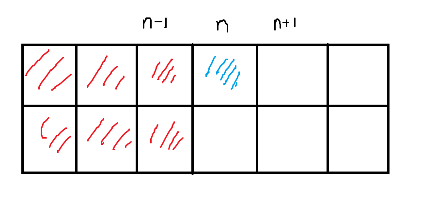
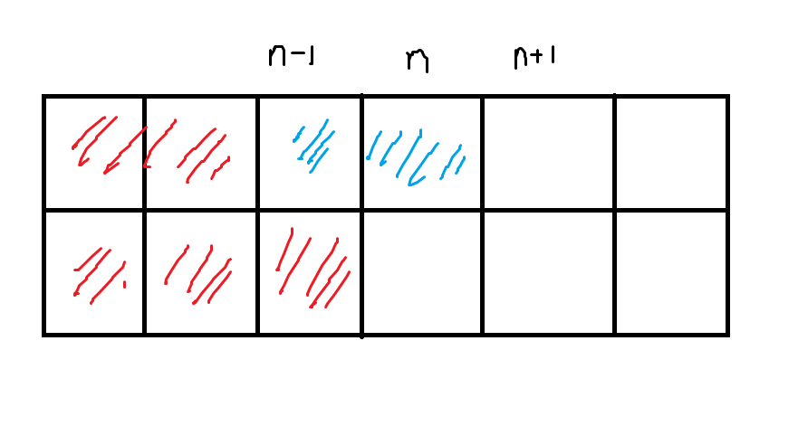
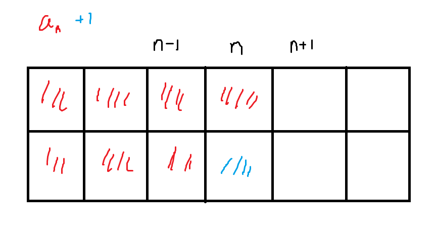
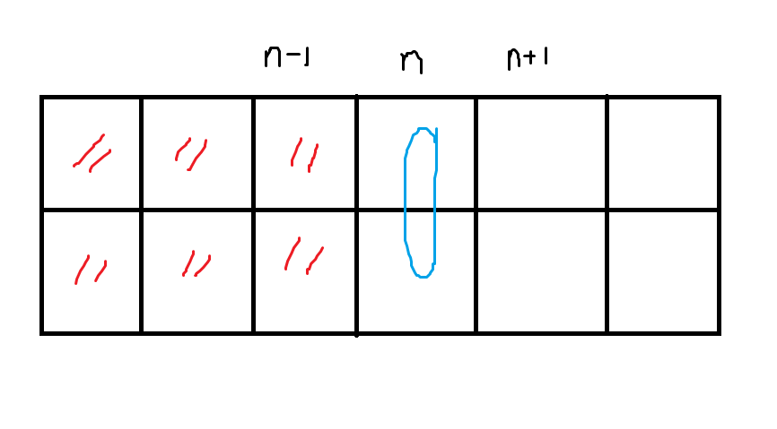
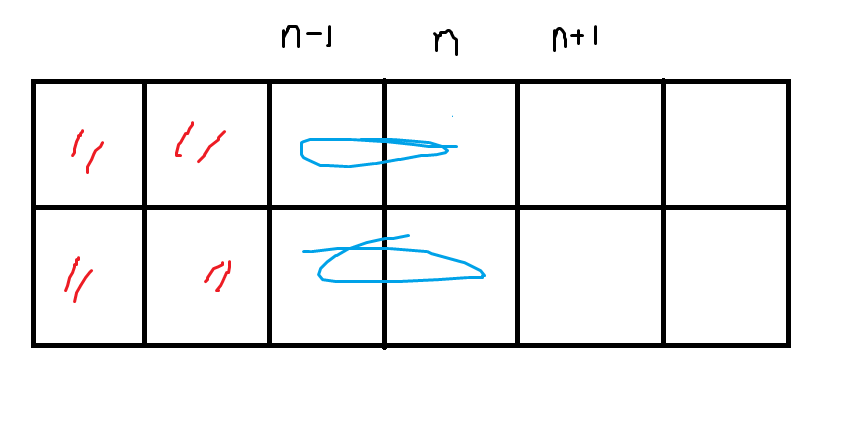

## 문제 접근

원형 타일채우기 DP 라고 생각하면 쉽다. 발상이 어려워서 플레티넘3 이 아닌가 조심스레 추측한다.

## 해결방법

1. 타일 채우기 문제와 같이 생각을 해보자.
2. 타일을 채우거나 그렇지 않거나만을 따져서 DP 테이블을 잘 짰다면, 경계선에 대한 부분은 경우의 수로 아예 나누어 선형 DP 로 바꾸어 풀어보도록 하자.

## 타일을 나누는 법?

내가 이부분을 생각못해서, 다른 블로그를 참고했다.

타일을 나누는 방법에는 총 3가지 경우의 수가 있을 것이다.

- 현재 열을 기준으로 윗쪽만 채웠을 경우 (1행만)  - a
- 현재 열을 기준으로 아랫쪽만 채웠을 경우 (2행만) - b
- 현재 열을 기준으로 윗쪽 아랫쪽 둘다 채웠을 경우 (둘다) - c

이런식으로 열을 1부터 N열 까지 채워나가다보면 선형적으로 풀 수가 있다.

a 경우의 점화식은 이렇게 될 것이다. 이때 `a_n` 은 n번째 행의 a 값이라는 뜻이다.

```
a_n = c_n-1 + 1  // 그냥 n행의 윗부분 한칸만 점령한 경우
if (n, 0) + (n-1, 0) <= w // 현재 열의 윗쪽 + 해당 칸의 왼쪽 칸을 같이 점령할 수 있는 경우
		a_n = min(a_n, b_n-1 + 1) // if 문의 점령을 하게 딱 맞추면 남은 칸은 b_n-1 이 된다.
```

위의 경우를 그림으로 표현해보면 아래와 같다.



a는 N행에 위에만 칠해져야한다. 기본적인 경우는 이렇게 될 것이다. 한칸만 칠하면 되니까 근데 이제 (n-1, 0) 과 (n, 0) 을 한번에 같이 칠할 수(나누어 점령) 있다면 이렇게 될 것이다.



b 경우도 점화식은 a와 크게 다르지 않다. 위의 경우와 뒤집어 생각할 수 있을 것이다.

```
b_n = c_n-1 + 1 // 이 경우도 그냥 n행의 밑부분을 점령한 경우
if (n, 1) + (n-1, 1) <= w
		b_n = min(b_n, a_n-1 + 1)
```

c의 경우는 쫌 다른데, 일단은 `a_n` 과 `b_n` 을 먼저 구하고 나중에 구해야한다. 왜냐하면 `c_n` 이 `a_n + 1` (그냥 나머지칸을 칠하는 경우) 가 최소 값이 될 수도 있기 때문이다.

또는 그냥 한번에 N행의 두칸을 한번에 점령할수도 있다.

또는 (N, 0) 과 (N-1, 0) / (N, 1) 과 (N-1, 1) 을 각각 한 부대가 점령할 수도 있을 것이다.

```
// 본 코드는 의사 코드다.
c_n = min(c_n-1 + 2, a_n + 1, b_n + 1)
if (n, 1) + (n, 0) <= w
		c_n = min(c_n-1 + 1, c_n)
if (n, 1) + (n, 0) <= w and (n-1, 1) + (n-1, 0) <= w
		c_n = min(c_n, c_n-2 + 2)
```








### 원형 구조는 어떻게 해결하나요?

타일을 나누는 방법을 올바르게 생각했다면 원형 구조도 자연스레 해결이 된다.

끝부분과 처음부분을 걸쳐서 생각해보는 것이다.

어쨌던 입력으로 받은 배열은 선형적이니 선형적으로 생각할 때, 처음과 끝부분이 있겠다.

이 처음과 끝 부분에 걸쳐서 나누어 점령을 할 수 있는지 경우의 수를 나누는 것이다.

그렇게한다면 총 4개의 경우의 수가 생긴다.

1. 처음 - 끝 부분에 걸쳐서 점령하지 않는 경우
2. 처음 - 끝 부분 열의 첫번째 행 칸 두곳을 한 부대가 점령하는 경우
3. 처음 - 끝 부분 열의 두번째 행 칸 두곳을 한 부대가 점령하는 경우
4. 2, 3 모두가 해당되는 경우.

해당 되는 경우를 모두 생각하게 되면 각각의 경우에 적용해야할 초기 값이 다르단 걸 인지할 것이다.

### 1의 경우의 수

a_1(맨앞) 과 b_1 모두 1이고, c_1은 (1, 0), (1, 1) 의 값에 따라(두 곳을 한 부대만으로 점령이 가능한지를 생각.) 2 또는 1이 결정된다.

이후 점화식에 따라 DP 테이블을 채우고, `c_n` 값이 정답의 후보값이 됩니다.

### 2의 경우의 수

a_1은 0이다. 시작 시 미리 점령한 타일은 나중에 더해줄 것이다.

b_1의 경우의 수는 존재하지 않음. 이미 (1, 0) 이 점령되었기 때문에.

c_1은 1이 된다. 이 또한 (1, 0) 이 점령 되었기 때문에, c_1은 이곳에 (1, 1)만을 채우는 경우 밖에 존재하지 않는다.

이후 점화식에 따라 DP 테이블을 채우게 되면, (n, 0) 이 이미 점령 되어 있기 때문에, `b_n + 1` 의 값이 후보값이 됩니다! (+1을 하는 이유는 시작 시 미리 점령한 타일을 나중에 더해주기 때문입니다.)

### 3의 경우의 수

2와 동일하다.

a_1은 존재할 수 없고, b_1은 0이다. 시작 시 미리 점령한 타일은 나중에 더해준다고 가정한다.

c_1은 1이된다. 이또한 위와 같은 이유에서다.

2와 마찬가지로 `a_n + 1` 의 값이 후보값이 됩니다.

### 4의 경우의 수

a_1과 b_1은 존재할 수 없고, c_1이 0이 된다.

(1, 1) 과 (1, 0) 이 모두 시작 시 점령되었기 때문이다.

정답의 후보값은 `c_n-1 + 2` 가 됩니다.

## 내가 생각하지 못한 것

### 1. 타일을 채우는 경우의 수를 잘못 나누었다.

이게 무슨 소리냐면, 해당 타일이 하나만 차지하는지, 다른 타일과 나누어서 차지하고 있는지를 내가 나누었다.

위와 같은 타일채우기 문제에서는 이미 차지하고 있는가 여부를 생각하고, 한번에 채울 때 나누어 채우는 방식으로 DP 테이블을 채워 나가야함을 인지하자!

### 2. 원형 DP라고 생각하고 여러번 DP를 돌려야한다고 생각했다.

이는 1번 문제와 같이 대응되는데, 원형 DP이고 아니고 간에, 타일을 이미 채웠다면 이를 생각할 필요 없이 그냥 경우의 수로 나누어서 풀면 되는 문제였다.

## 소스 코드

```cpp
#include<iostream>
#include<algorithm>
#include<cstring>
using namespace std;

int dp[3][10001]; // 타일 문제 처럼 해당 행에 어느부분을 채우는가로 나누어야한다.
int map[10001][2];
int n, w;

const int INF = 987654321;

void solve() {
	// 2열부터 시작해야함.
	// 그러려면 1열까진 내용을 다 채워놔야겠지
	for (int i = 2; i <= n; ++i) {
		// 기본값 세팅
		dp[0][i] = dp[2][i - 1] + 1;
		dp[1][i] = dp[2][i - 1] + 1;
		if (map[i][0] + map[i][1] <= w) {
			dp[2][i] = dp[2][i - 1] + 1;
		}
		else dp[2][i] = dp[2][i - 1] + 2;
		if (map[i - 1][0] + map[i][0] <= w && map[i - 1][1] + map[i][1] <= w) {
			dp[2][i] = min(dp[2][i], dp[2][i - 2] + 2);
		}

		if (map[i][0] + map[i - 1][0] <= w) {
			dp[0][i] = min(dp[0][i], dp[1][i - 1] + 1);
		}
		if (map[i][1] + map[i - 1][1] <= w) {
			dp[1][i] = min(dp[1][i], dp[0][i - 1] + 1);
		}
		
		dp[2][i] = min(dp[2][i], min(dp[1][i] + 1, dp[0][i] + 1));
	}
}

int main() {
	cout.tie(0); cin.tie(0)->sync_with_stdio(0);
	int tc; cin >> tc;
	while (tc--) {
		cin >> n >> w;
		
		for (int j = 0; j < 2; ++j) {
			for (int i = 1; i <= n; ++i) {
				cin >> map[i][j];
			}
		}
		int ans;
		// 시작 case 4개.
		
		// 끝 - 시작 부분에 특수부대를 걸치지 않은 경우
		for (int i = 0; i < 3; ++i)
			memset(dp[i], 0, sizeof(dp[i]));
		dp[1][1] = dp[0][1] = 1; // 쌩으로 하나 채운 경우
		if (map[1][0] + map[1][1] <= w) {
			dp[2][1] = 1;
		}
		else dp[2][1] = 2;
		solve();
		ans = dp[2][n];

		// 위에 만 걸친 경우
		if (map[1][0] + map[n][0] <= w) {
			for (int i = 0; i < 3; ++i)
				memset(dp[i], 0, sizeof(dp[i]));
			dp[0][1] = 0; // 초기 상태가 이미 dp[0][1] 이다.
			dp[1][1] = INF; // 이곳을 참조할 경우의 수가 없다.
			dp[2][1] = 1;
			solve();
			ans = min(ans, dp[1][n] + 1);
		}
		if (map[1][1] + map[n][1] <= w) {
			for (int i = 0; i < 3; ++i)
				memset(dp[i], 0, sizeof(dp[i]));
			dp[0][1] = INF; // 불가능
			dp[1][1] = 0;
			dp[2][1] = 1;
			solve();
			ans = min(ans, dp[0][n] + 1);
		}
		if (map[1][0] + map[n][0] <= w && map[1][1] + map[n][1] <= w) {
			for (int i = 0; i < 3; ++i)
				memset(dp[i], 0, sizeof(dp[i]));
			dp[0][1] = dp[1][1] = INF; // 불가능
			dp[2][1] = 0;
			solve();
			ans = min(ans, dp[2][n - 1] + 2);
		}
		cout << ans << '\n';
	}

}
```